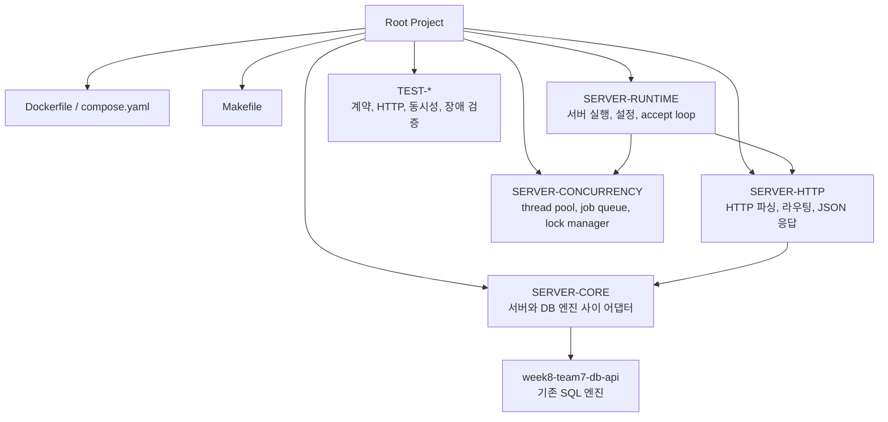
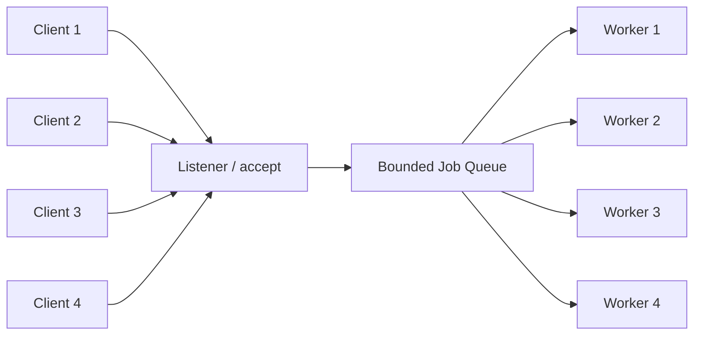
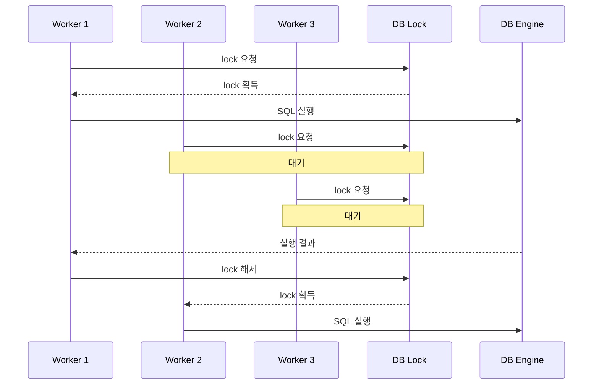
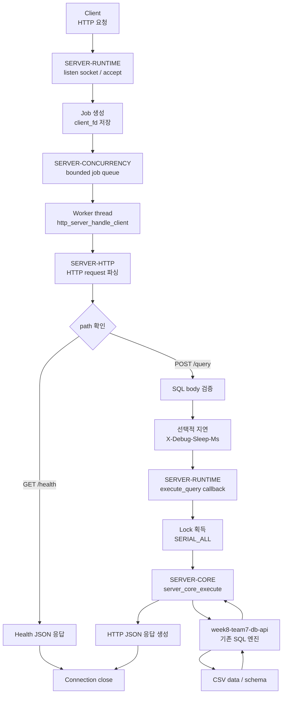

# 미니 DBMS API 서버

## 1. 프로젝트 소개

이 프로젝트는 기존 SQL 엔진인 `week8-team7-db-api`를 HTTP API 서버로 감싼 미니 DBMS 서버입니다.

기존 엔진은 SQL 파싱, 실행, CSV 기반 저장소 접근을 담당하고, 루트 프로젝트는 그 엔진을 서버 환경에서 사용할 수 있도록 다음 기능을 추가합니다.

- `GET /health` 헬스체크 API
- `POST /query` SQL 실행 API
- Docker 기반 실행 환경
- worker thread pool 기반 동시 요청 수용
- bounded job queue 기반 요청 대기열
- DB 실행 구간 순차 lock
- 동시성 검증 하네스
- 지연 요청 테스트용 `X-Debug-Sleep-Ms` 헤더

현재 동시성 모델의 핵심은 **요청은 동시에 받고, 실제 DB 실행 구간은 안전하게 순차 처리**하는 것입니다.

즉 API 서버 레벨에서는 여러 요청을 동시에 받아 worker에 배정하지만, DB 엔진 실행은 `CONCURRENCY_LOCK_POLICY_SERIAL_ALL` 정책으로 보호합니다.

## 2. 프로젝트 구조



주요 디렉터리 책임은 다음과 같습니다.

| 디렉터리 | 역할 |
| --- | --- |
| `SERVER-RUNTIME` | 서버 실행 진입점, 설정 로딩, listen socket, accept loop, thread pool 연결 |
| `SERVER-HTTP` | HTTP request 파싱, `/health`, `/query` 라우팅, JSON 응답 생성 |
| `SERVER-CONCURRENCY` | worker thread pool, bounded job queue, lock manager |
| `SERVER-CORE` | 기존 DB 엔진을 서버에서 호출하기 위한 어댑터 |
| `week8-team7-db-api` | 기존 SQL 엔진, parser, executor, CSV storage, index |
| `TEST-CONCURRENCY` | 동시 요청, INSERT 결과 무결성 검증 |
| `TEST-HTTP-FUNCTIONAL` | HTTP API 계약 검증 |
| `TEST-ENGINE-ADAPTER` | 서버 코어와 기존 엔진 사이 계약 검증 |
| `TEST-EDGE-FAILURE` | queue overflow, oversized request 등 경계 실패 케이스 검증 |

최종 서버 바이너리는 루트 `Makefile`로 빌드되며, 결과물은 다음 위치에 생성됩니다.

```text
build/bin/db_server
```

## 3. 실행과 검증

### 서버 실행

```bash
docker compose up -d server
```

### 서버 상태 확인

```bash
docker compose logs --no-color --tail 50 server
docker compose exec server curl --fail --silent --show-error http://127.0.0.1:8080/health
```

정상 응답 예시:

```json
{"ok":true,"path":"/health","status_code":200,"message":"server is healthy"}
```

### SELECT 요청

```bash
docker compose exec server bash -lc "curl --fail --silent --show-error -H 'Content-Type: text/plain; charset=utf-8' --data 'SELECT name FROM student WHERE id = 1;' http://127.0.0.1:8080/query"
```

### 동시성 테스트 전체 실행

```bash
docker compose run --rm dev bash -lc "python3 TEST-CONCURRENCY/scripts/run_concurrency_case.py TEST-CONCURRENCY/cases/concurrent_select_student.json TEST-CONCURRENCY/cases/concurrent_insert_student.json TEST-CONCURRENCY/cases/mixed_select_insert_student.json --base-url http://server:8080 --timeout 15"
```

### 지연 요청 테스트

`X-Debug-Sleep-Ms` 헤더를 사용하면 HTTP 계층에서 SQL 실행 직전에 지정 시간만큼 지연을 줄 수 있습니다.

```bash
docker compose exec server bash -lc "curl --silent --show-error -H 'Content-Type: text/plain; charset=utf-8' -H 'X-Debug-Sleep-Ms: 3000' --data 'SELECT name FROM student WHERE id = 1;' http://127.0.0.1:8080/query"
```

이 기능은 DB 엔진 병렬성을 확인하기 위한 기능이 아니라, API 서버가 여러 요청을 동시에 받아 worker에서 처리할 수 있는지 확인하기 위한 디버그 기능입니다.

### 서버 종료

```bash
docker compose down
```

## 4. 주요 기능

### HTTP API

서버는 최소 API로 `GET /health`, `POST /query`를 제공합니다.

- `/health`: 서버 상태 확인
- `/query`: raw SQL text body를 받아 DB 엔진 실행

### 지연 요청

`POST /query` 요청에 `X-Debug-Sleep-Ms` 헤더를 넣으면 HTTP 라우팅 이후, DB 실행 callback 호출 전에 지연이 적용됩니다.

```text
X-Debug-Sleep-Ms: 3000
```

이 헤더는 동시 요청 시연과 테스트를 쉽게 하기 위한 디버그 기능입니다.

### 동시 요청 수용

서버는 하나의 요청만 처리하는 구조가 아니라, listener가 연결을 받고 thread pool에 작업을 제출합니다.



기본 worker 수는 4개입니다.

```text
DB_SERVER_WORKERS=4
```

worker 수는 Docker 실행 시 환경 변수로 조정할 수 있습니다.

```bash
DB_SERVER_WORKERS=8 docker compose up -d server
```

### 스레드풀과 대기열

worker 수와 queue 크기는 다음 관계를 가집니다.

```text
queue_capacity = max(worker_count * 4, 8)
```

기본값 기준:

```text
worker_count = 4
queue_capacity = 16
listen_backlog = 128
```

queue가 가득 찬 상태에서 추가 요청이 들어오면 서버는 요청을 무한히 기다리게 하지 않고 `503 server_busy`로 응답합니다.

```json
{
  "ok": false,
  "status_code": 503,
  "error_code": "server_busy",
  "message": "server queue is full"
}
```

### 순차 lock

현재 런타임은 `CONCURRENCY_LOCK_POLICY_SERIAL_ALL` 정책으로 thread pool을 초기화합니다.

따라서 요청은 동시에 worker에 배정될 수 있지만, 실제 DB 엔진 실행 구간은 한 번에 하나의 작업만 통과합니다.



이 구조의 의미는 다음과 같습니다.

- API 서버는 동시에 여러 요청을 받을 수 있습니다.
- worker thread도 여러 요청을 동시에 잡을 수 있습니다.
- DB 실행은 데이터 무결성을 위해 순차 처리됩니다.
- 현재 기본 설정은 read-read 병렬 실행을 의미하지 않습니다.

## 5. 요청 처리 흐름

클라이언트가 SQL 요청을 보내면 서버 내부에서는 다음 흐름으로 처리됩니다.



핵심 흐름은 다음 한 줄로 정리할 수 있습니다.

```text
Client -> Runtime -> Queue -> Worker -> HTTP -> Runtime Callback -> Lock -> Core -> DB Engine -> JSON Response
```

## 6. 쿼리와 API 명세

### `GET /health`

서버 상태를 확인합니다.

```http
GET /health HTTP/1.1
Host: localhost:8080
```

성공 응답:

```json
{
  "ok": true,
  "path": "/health",
  "status_code": 200,
  "message": "server is healthy"
}
```

### `POST /query`

SQL 문자열을 raw text body로 전달합니다.

```http
POST /query HTTP/1.1
Host: localhost:8080
Content-Type: text/plain; charset=utf-8

SELECT name FROM student WHERE id = 1;
```

성공 응답:

```json
{
  "ok": true,
  "path": "/query",
  "status_code": 200,
  "message": "SELECT 1",
  "affected_rows": 1,
  "output_text": "+--------+\n| name   |\n+--------+\n| name_1 |\n+--------+\n"
}
```

### SELECT 예시

```sql
SELECT name FROM student WHERE id = 1;
```

curl:

```bash
curl --fail --silent --show-error \
  -H 'Content-Type: text/plain; charset=utf-8' \
  --data 'SELECT name FROM student WHERE id = 1;' \
  http://127.0.0.1:8080/query
```

### INSERT 예시

```sql
INSERT INTO student (department, student_number, name, age)
VALUES ('demo', 990001, 'demo_user', 20);
```

curl:

```bash
curl --fail --silent --show-error \
  -H 'Content-Type: text/plain; charset=utf-8' \
  --data "INSERT INTO student (department, student_number, name, age) VALUES ('demo', 990001, 'demo_user', 20);" \
  http://127.0.0.1:8080/query
```

성공 응답 예시:

```json
{
  "ok": true,
  "path": "/query",
  "status_code": 200,
  "message": "INSERT 1",
  "affected_rows": 1,
  "output_text": ""
}
```


## 7. 회고

서브 에이전트를 활용해 모듈별 역할과 테스트 관점을 나누어 정리했다.
이를 통해 서버 런타임, HTTP 계약, 동시성 처리, 검증 흐름을 더 빠르게 분리해서 파악할 수 있었다.
